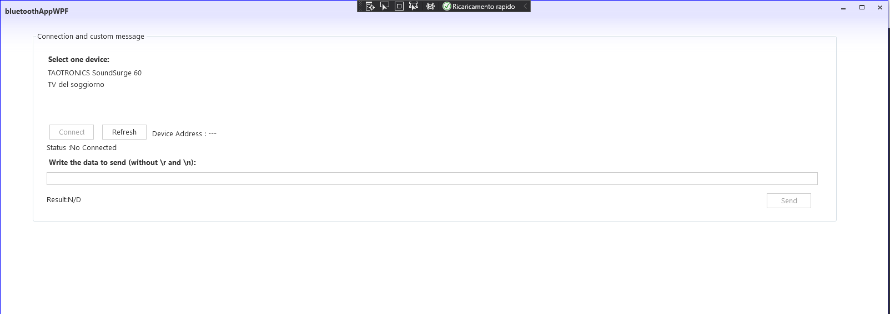

# bluetoothAppWPF
Windows WPF application (Windows Presentation Foundation) in C# with Bluetooth communication

This application written in C # allows you to search for nearby bluetooth devices (action that is triggered at startup).
The application shows the list of devices that are found with their MAC address.
By clicking on a device it's possible to pair and, through the appropriate text field, send commands via bluetooth and read any response from the device.

### Package used

- 32feet.NET for Bluetooth

### Run

You can import .sln file inside Visual Studio
